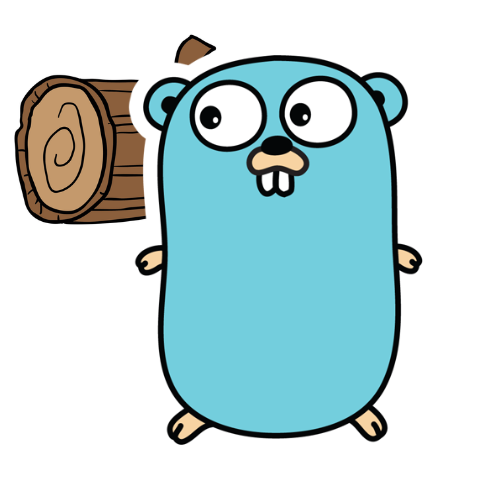
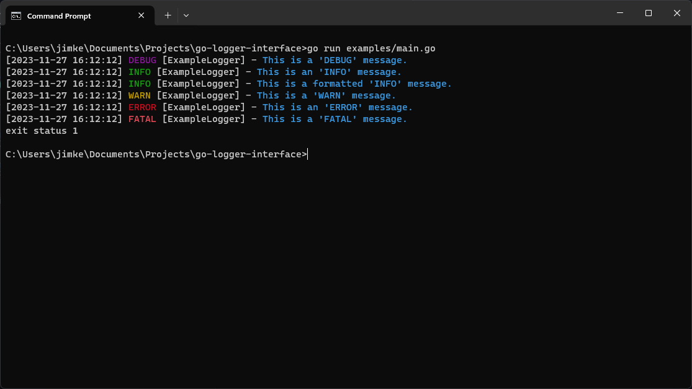

<a name="readme-top"></a>

[![Contributors][contributors-shield]][contributors-url]
[![Forks][forks-shield]][forks-url]
[![Stargazers][stars-shield]][stars-url]
[![Issues][issues-shield]][issues-url]
[![MIT License][license-shield]][license-url]
[![LinkedIn][linkedin-shield]][linkedin-url]

<!-- PROJECT LOGO -->
<br />
<div align="center">
  <a href="https://github.com/jamestkelly/go-logger-interface">
    
  </a>

<h3 align="center">Go Logger Interface</h3>

  <p align="center">
    A simple and colourful logger interface wrapper on-top of the standard library Log for printing formatted lines to the console.
    <br />
    <a href="https://github.com/jamestkelly/go-logger-interface"><strong>Explore the docs »</strong></a>
    <br />
    <br />
    <a href="https://github.com/jamestkelly/go-logger-interface">View Demo</a>
    ·
    <a href="https://github.com/jamestkelly/go-logger-interface/issues">Report Bug</a>
    ·
    <a href="https://github.com/jamestkelly/go-logger-interface/issues">Request Feature</a>
  </p>
</div>

<!-- TABLE OF CONTENTS -->
<details>
  <summary>Table of Contents</summary>
  <ol>
    <li>
      <a href="#about-the-project">About The Project</a>
      <ul>
        <li><a href="#built-with">Built With</a></li>
      </ul>
    </li>
    <li>
      <a href="#getting-started">Getting Started</a>
      <ul>
        <li><a href="#prerequisites">Prerequisites</a></li>
        <li><a href="#installation">Installation</a></li>
      </ul>
    </li>
    <li><a href="#usage">Usage</a></li>
    <li><a href="#roadmap">Roadmap</a></li>
    <li><a href="#contributing">Contributing</a></li>
    <li><a href="#license">License</a></li>
    <li><a href="#contact">Contact</a></li>
    <li><a href="#acknowledgments">Acknowledgments</a></li>
  </ol>
</details>

<!-- ABOUT THE PROJECT -->
## About The Project

This project was made to address the need for myself in having a colourful, standardised output similar to `LoggerInterface` solutions available in other languages.

In short, this module is a wrapper on top of the standard library `Log` to output formatted logs to the terminal for a given service in the following format:



<p align="right">(<a href="#readme-top">back to top</a>)</p>

### Built With

* [![Go][Go.go]][Go-url]

<p align="right">(<a href="#readme-top">back to top</a>)</p>

<!-- GETTING STARTED -->
## Getting Started

### Prerequisites

It is assumed that you already have Go installed on your machine.
* go
  ```sh
  https://go.dev/doc/install # Follow the instructions to install Go
  ```

### Installation

1. Import the module to your project.
   ```sh
   go get github.com/jamestkelly/go-logger-interface
   ```

<p align="right">(<a href="#readme-top">back to top</a>)</p>

<!-- USAGE EXAMPLES -->
## Usage

To utilise the package after installing the module, simply create a logger interface at the top of your given file and use it like so:

```go
// example.go
import (
    github.com/jamestkelly/go-logger-interface
)

var (
    exampleLogger = logger.LoggerInterface{Prefix: "ExampleLoggerInterface"}
)

// main
// Example main function to log a bunch of statements using LoggerInterface
func main() {
	exampleLogger.LogMessage(
		"This is a 'DEBUG' message.",
		"DEBUG",
	)

	exampleLogger.LogMessage(
		"This is an 'INFO' message.",
		"INFO",
	)

	exampleLogger.LogMessage(
		fmt.Sprintf("This is a %s 'INFO' message.", "formatted"),
		"INFO",
	)

	exampleLogger.LogMessage(
		"This is a 'WARN' message.",
		"WARN",
	)

	exampleLogger.LogMessage(
		"This is an 'ERROR' message.",
		"ERROR",
	)

	exampleLogger.LogMessage(
		"This is a 'FATAL' message.",
		"FATAL",
	)
}
```

_For more examples, please refer to the [Examples](https://github.com/jamestkelly/go-logger-interface/tree/main/examples)_

<p align="right">(<a href="#readme-top">back to top</a>)</p>

<!-- ROADMAP -->
## Roadmap

- [x] Create the package and make it available publically.

See the [open issues](https://github.com/jamestkelly/go-logger-interface/issues) for a full list of proposed features (and known issues).

<p align="right">(<a href="#readme-top">back to top</a>)</p>

<!-- CONTRIBUTING -->
## Contributing

Contributions are what make the open source community such an amazing place to learn, inspire, and create. Any contributions you make are **greatly appreciated**.

If you have a suggestion that would make this better, please fork the repo and create a pull request. You can also simply open an issue with the tag "enhancement".
Don't forget to give the project a star! Thanks again!

1. Fork the Project
2. Create your Feature Branch (`git checkout -b feature/AmazingFeature`)
3. Commit your Changes (`git commit -m 'Add some AmazingFeature'`)
4. Push to the Branch (`git push origin feature/AmazingFeature`)
5. Open a Pull Request

<p align="right">(<a href="#readme-top">back to top</a>)</p>

<!-- LICENSE -->
## License

Distributed under the MIT License. See `LICENSE.txt` for more information.

<p align="right">(<a href="#readme-top">back to top</a>)</p>

<!-- CONTACT -->
## Contact

Jim Kelly - jimkelly.t@outlook.com

Project Link: [https://github.com/jamestkelly/go-logger-interface](https://github.com/jamestkelly/go-logger-interface)

<p align="right">(<a href="#readme-top">back to top</a>)</p>

<!-- ACKNOWLEDGMENTS -->
## Acknowledgments

* [Color - A color package for Go (golang)](https://github.com/fatih/color)
* [Best README Template](https://github.com/othneildrew/Best-README-Template)

<p align="right">(<a href="#readme-top">back to top</a>)</p>

<!-- MARKDOWN LINKS & IMAGES -->
<!-- https://www.markdownguide.org/basic-syntax/#reference-style-links -->
[contributors-shield]: https://img.shields.io/github/contributors/jamestkelly/go-logger-interface.svg?style=for-the-badge
[contributors-url]: https://github.com/jamestkelly/go-logger-interface/graphs/contributors
[forks-shield]: https://img.shields.io/github/forks/jamestkelly/go-logger-interface.svg?style=for-the-badge
[forks-url]: https://github.com/jamestkelly/go-logger-interface/network/members
[stars-shield]: https://img.shields.io/github/stars/jamestkelly/go-logger-interface.svg?style=for-the-badge
[stars-url]: https://github.com/jamestkelly/go-logger-interface/stargazers
[issues-shield]: https://img.shields.io/github/issues/jamestkelly/go-logger-interface.svg?style=for-the-badge
[issues-url]: https://github.com/jamestkelly/go-logger-interface/issues
[license-shield]: https://img.shields.io/github/license/jamestkelly/go-logger-interface.svg?style=for-the-badge
[license-url]: https://github.com/jamestkelly/go-logger-interface/blob/master/LICENSE.txt
[linkedin-shield]: https://img.shields.io/badge/-LinkedIn-black.svg?style=for-the-badge&logo=linkedin&colorB=555
[linkedin-url]: https://linkedin.com/in/jimkellyt
[Go.go]: https://img.shields.io/badge/go-%2300ADD8.svg?style=for-the-badge&logo=go&logoColor=white
[Go-url]: https://go.dev/
